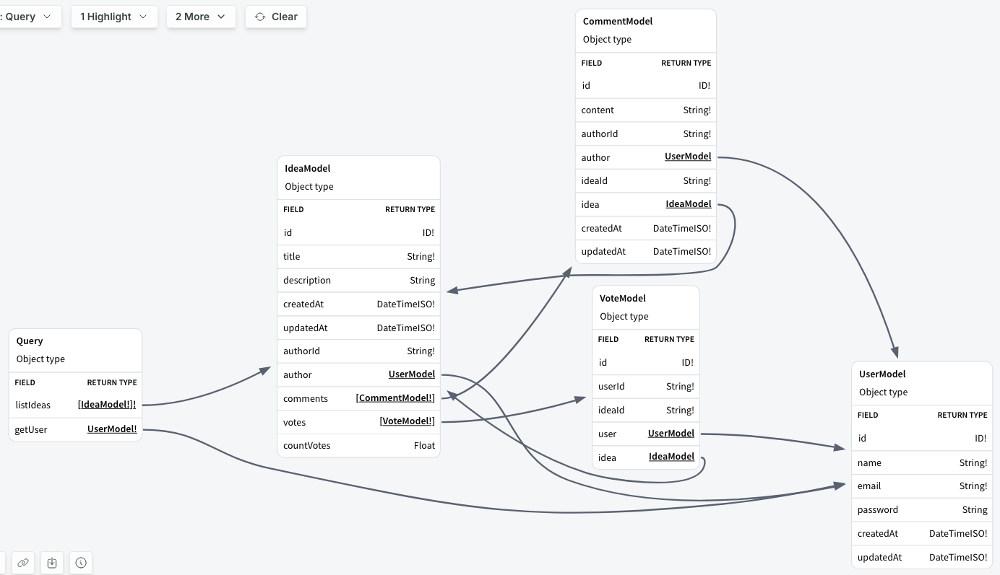
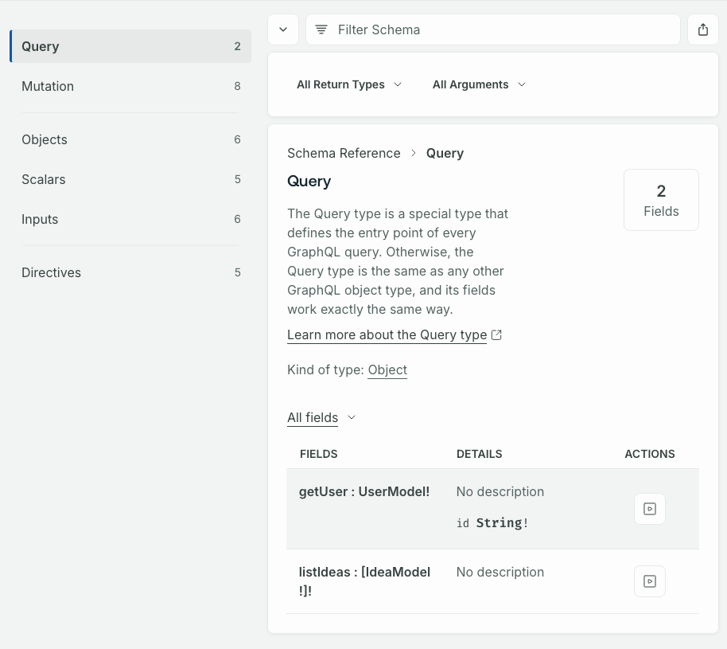
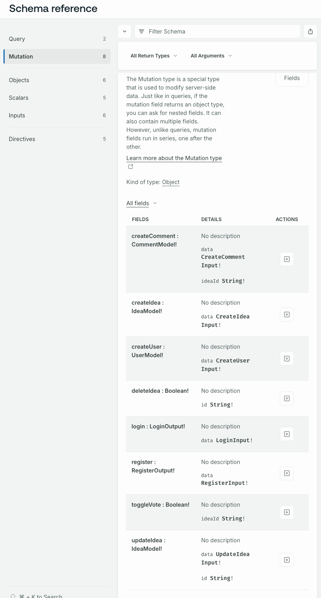
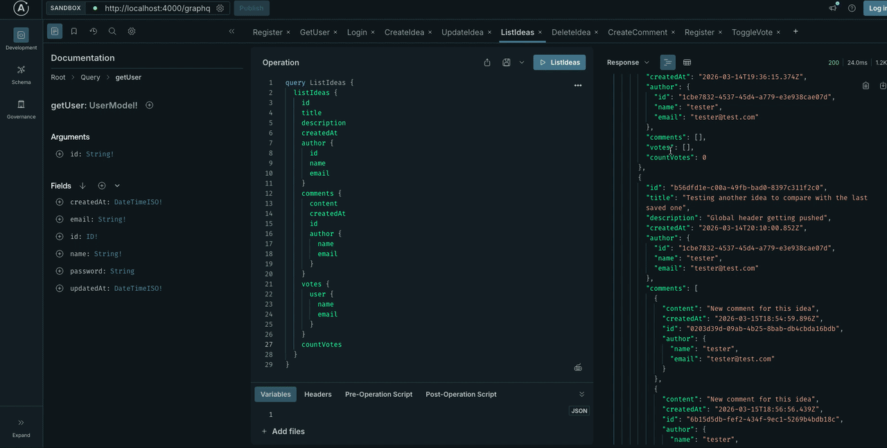

# GraphQL Backend

A GraphQL API built with TypeScript, TypeGraphQL, Prisma, and SQLite. Supports user authentication, ideas, comments, and votes.

## Stack

- **Runtime:** Node.js + TypeScript
- **GraphQL:** TypeGraphQL + Apollo Server
- **ORM:** Prisma v7 (SQLite)
- **Auth:** JWT

## Database

### Table Relationships



## API Reference

### Queries



### Mutations



## Demo

Screen recording of queries and mutations running live in Apollo GraphQL Studio:



## Getting Started

```bash
pnpm install
pnpm prisma migrate dev
pnpm dev
```
